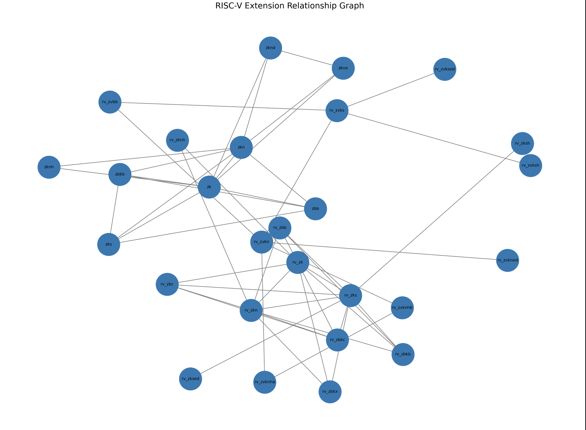

# RISC-V Instruction Set Explorer

A Python-based tool that analyzes RISC-V instruction metadata and cross-references extension usage with the official ISA manual.

This project was built as part of the **RISC-V Mentorship Coding Challenge** and covers all required tiers along with bonus enhancements such as testing, graph generation, and automated data fetching.

---

## Features

### Tier 1 — Instruction Set Parsing

* Parses `instr_dict.json` from the RISC-V Extensions Landscape
* Groups instructions by extension
* Generates a clean summary table:

  * Extension name
  * Instruction count
  * Example mnemonic
* Detects instructions belonging to multiple extensions

---

### Tier 2 — Cross-Reference with ISA Manual

* Automatically fetches the official RISC-V ISA manual source
* Scans AsciiDoc (`.adoc`) files to extract extension names
* Normalizes extension naming (e.g., `rv64_zba → zba`)
* Compares:

  * Extensions present in JSON but not in manual
  * Extensions present in manual but not in JSON
* Generates summary counts and detailed reports

---

### Tier 3 — Bonus Features

* Unit tests for all major modules
* Text-based graph of extension relationships
* Visual graph (`.png`) using NetworkX + Matplotlib
* Clean modular architecture
* Automated dependency fetching (no large files in repo)

---

## Project Structure

```
RISC_V-challenge/
│
├── data/
│   └── instr_dict.json
│
├── output/
│   ├── tier1_summary.txt
│   ├── tier2_cross_reference.txt
│   └── extension_graph.png
│
├── scripts/
│   └── fetch_isa_manual.py
│
├── src/
│   ├── instruction_parser.py
│   ├── tier1.py
│   ├── normalizer.py
│   ├── manual_parser.py
│   ├── cross_reference.py
│   ├── graph_builder.py
│   └── main.py
│
├── tests/
│   ├── test_parser.py
│   ├── test_tier1.py
│   ├── test_manual_parser.py
│   ├── test_cross_reference.py
│
├── requirements.txt
└── README.md
```

---

## Setup

### 1. Clone the repository

```bash
git clone https://github.com/ayush844/RISC-V-Mentorship-Coding-Challenge.git
cd RISC-V-Mentorship-Coding-Challenge
```

---

### 2. Create virtual environment

```bash
python3 -m venv venv
source venv/bin/activate
```

---

### 3. Install dependencies

```bash
pip install -r requirements.txt
```

---

## ▶ Run the Program

```bash
python -m src.main
```

---

## Important Note (ISA Manual Fetching)

The official RISC-V ISA manual repository is **not committed** to this repo to keep it lightweight.

Instead:

* A script (`scripts/fetch_isa_manual.py`) automatically fetches the required source files (`src/`)
* This avoids pushing hundreds of files and keeps the repository clean

When you run the program for the first time:

```txt
ISA manual source not found. Fetching automatically...
```

---

## Sample Output

### Tier 1 Summary

```
Extension       | Count  | Example
---------------------------------------------
rv64_zba        | 5      | add_uw
rv64_zbb        | 9      | clzw
```

---

### Multi-Extension Instructions

```
Instruction     | Extensions
--------------------------------------------------
aes32dsi        | rv32_zk, rv32_zkn, rv32_zknd
```

---

### Tier 2 Summary

```
Total JSON extensions: 42
Matched extensions: 37
Only in JSON: 3
Only in ISA manual: 5
```

---

## Extension Relationship Graph

### Text-based graph

```
rv_zk -> rv_zkn, rv_zknd
rv_zkn -> rv_zk, rv_zknd
```

---

### Visual graph

Generated automatically:

```
output/extension_graph.png
```


---

## Design Decisions

* **Normalization Layer**

  * Handles differences like `rv64_zba` vs `Zba`
  * Ensures accurate cross-referencing

* **Automated Fetch Script**

  * Avoids committing large external repositories
  * Keeps project lightweight and reproducible

* **Graph Representation**

  * Uses shared instructions to build relationships
  * Provides both text and visual outputs

* **Modular Architecture**

  * Separation of concerns:

    * parsing
    * processing
    * normalization
    * graph building

---

## Assumptions

* Extension names in the ISA manual may appear in different formats
* Only the `src/` directory of the ISA manual is required
* Instructions without extensions are ignored
* Graph relationships are based only on shared instructions

---

## Running Tests

```bash
pytest -v
```

---

## Final Notes

This project demonstrates:

* Data parsing and transformation
* Cross-referencing between heterogeneous sources
* Handling real-world inconsistencies in datasets
* Clean software engineering practices

---

## Author

Ayush Sharma
